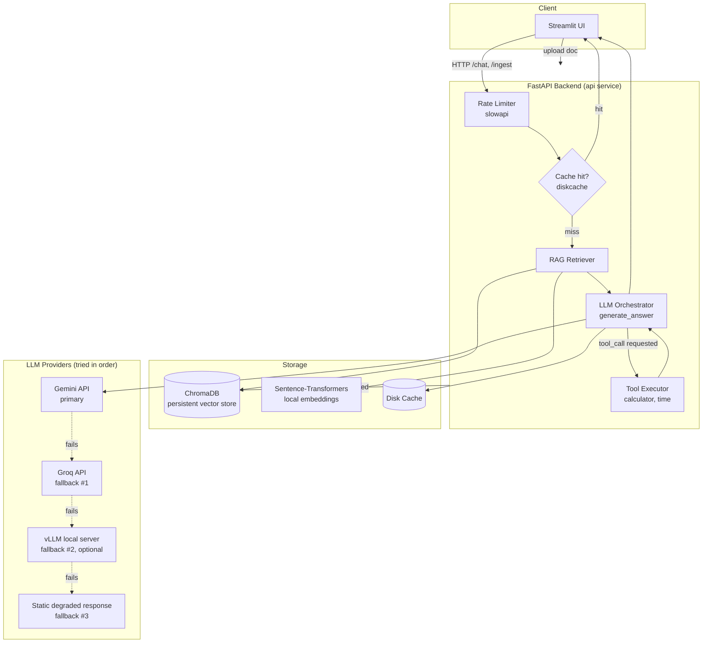

# Architecture

## Request flow: `/chat`

1. **Rate limiting** — `slowapi` rejects requests beyond the configured
   per-minute quota (per client IP) before any expensive work happens.
2. **Cache lookup** — a hash of `(query, retrieved context)` is checked
   against `diskcache`; a hit returns immediately with `cached: true`.
3. **Retrieval (if `use_rag=true`)** — the query is embedded locally
   (sentence-transformers), and the top-k nearest chunks are pulled from
   ChromaDB.
4. **Generation** — `generate_answer()` tries providers in order: **Gemini
   → Groq → local vLLM (if enabled) → static fallback message**. Each
   provider call is wrapped in retry-with-exponential-backoff (`tenacity`)
   before the orchestrator moves to the next provider.
5. **Tool calling** — if the model requests a tool (e.g. `calculator`), the
   backend executes it locally and feeds the result back for a final answer.
6. **Response caching** — successful (non-fallback) responses are cached
   for `CACHE_TTL_SECONDS`.

## Why these components

| Concern | Choice | Reason |
|---|---|---|
| Primary LLM | Gemini | Free API tier, no billing setup required |
| Fallback LLM | Groq | Also free, OpenAI-compatible tool calling, very low latency |
| Vector DB | ChromaDB | Embedded (no separate server), persists to disk, good enough for a single-node deployment |
| Embeddings | sentence-transformers (local) | Free, offline, avoids a second API dependency for ingestion |
| Cache | diskcache | Simple, persistent across restarts, no extra infra (e.g. Redis) needed for this scale |
| Rate limiting | slowapi | Minimal FastAPI-native integration |
| Retries | tenacity | Declarative exponential backoff, easy to reason about |

## Concurrency & performance

- All blocking calls (embedding, vector search, LLM SDK calls) are pushed
  onto a thread pool via `run_in_threadpool`, so the async event loop stays
  free to accept new requests while others are in flight.
- This gives effective concurrent request handling without needing a fully
  async LLM SDK.

## ONNX conversion — not applicable, justification

The two LLM code paths in this project are:
1. **Gemini / Groq** — hosted APIs; there is no local model file to convert.
2. **vLLM-served open-source model** (optional, GPU-only) — vLLM uses its
   own optimized inference engine (PagedAttention + continuous batching)
   and does not run on the ONNX Runtime; converting to ONNX would bypass
   the exact optimizations vLLM is chosen for. If a CPU-only ONNX path is
   needed instead of vLLM, `optimum[onnxruntime]` can export a small model
   (e.g. `distilgpt2` or a quantized Llama variant) — noted here as a
   documented alternative rather than implemented, since the assignment
   marks ONNX as optional "where applicable."
